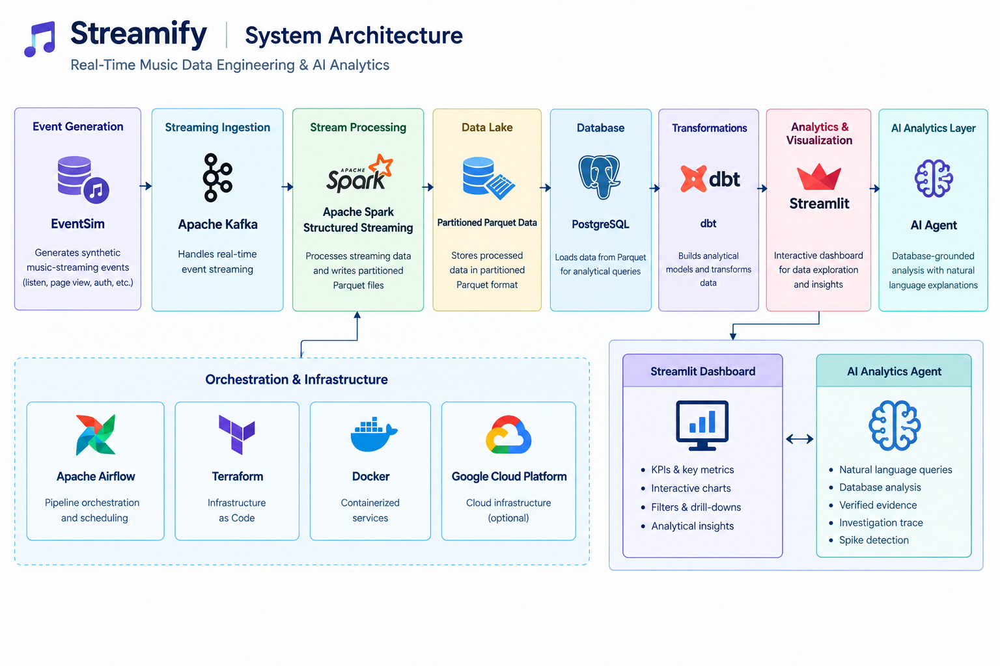

## Streamify — Real-Time Music Data Engineering & AI Analytics

An end-to-end data engineering project that simulates a music-streaming platform and processes user activity through a streaming data pipeline.

The project combines Apache Kafka, Apache Spark Structured Streaming, Parquet, PostgreSQL, dbt, Docker, Airflow, Terraform, Streamlit, and a database-grounded AI analytics layer.

The current version has been validated locally and includes an interactive analytics dashboard and AI-powered analytical investigations.

---

## 🏗️ System Architecture

The Streamify pipeline connects event generation, streaming ingestion, processing, storage, transformation, analytics, and AI-powered analysis.



## 📌 Project Overview

Modern streaming platforms generate large volumes of user activity such as:

- Song plays
- Page views
- Authentication events
- User interactions

Streamify demonstrates how these events can move through a data engineering pipeline and become structured, analytics-ready data.

### Data Flow

```text
EventSim
   ↓
Apache Kafka
   ↓
Apache Spark Structured Streaming
   ↓
Partitioned Parquet Data
   ↓
PostgreSQL
   ↓
dbt
   ↓
Analytical Data Models
   ↓
Streamlit Dashboard
   ↓
AI Analytics Agent
## 🚀 Key Features
Real-Time Data Pipeline

Synthetic music-streaming events are generated using EventSim and published through Kafka.

Apache Spark Structured Streaming processes incoming events and writes partitioned Parquet data.

Supported event types include:

listen_events
page_view_events
auth_events
## Analytical Data Warehouse

Processed data is loaded into PostgreSQL and transformed using dbt.

The analytical model contains:
fact_streams
    │
    ├── dim_users
    ├── dim_songs
    ├── dim_artists
    ├── dim_location
    └── dim_datetime
This dimensional structure supports analysis across users, songs, artists, locations, and time.

## 📊 Streamlit Analytics Dashboard

The customized Streamlit dashboard provides:

Total Streams
Unique Users
Unique Artists
Unique Songs
Streams over time
Streams by user level
Streams by gender
Streams by state
Most active artists
Most streamed songs
Interactive analytical filters
Dashboard
## 🤖 AI Analytics Layer

The project includes a database-grounded AI analytics layer.

The system separates numerical analysis from natural-language explanation.
User Question
      ↓
AI Agent
      ↓
Analysis Tool
      ↓
PostgreSQL
      ↓
Verified Results
      ↓
LLM Explanation
      ↓
Final Answer
The language model is used to explain verified analytical results rather than independently inventing numerical answers.

## Example Questions
Which states have the most streams?

Which states have more paid-user streams than free-user streams?

Which artists are the most streamed?

Which user level generates the most streams?

At what hours is streaming activity highest?

Was there an unusual spike in streaming activity?
## 🔎 Investigation Trace & Verified Evidence

For multi-step analytical questions, the dashboard can display the investigation process through:

Investigation Trace
Verified Evidence
Analytical metrics
AI-generated explanation

Example:

Which states have the most streams, and are they mainly paid or free?

The system performs the database analysis first and then uses the verified results to generate the explanation.
## 📈 Hourly Stream Spike Detection

The AI analytics layer also analyzes hourly streaming activity.

For each hour, the system calculates:

Stream count
Average hourly streams
Population standard deviation
Z-score
Spike indicator

A statistical spike is identified when the configured z-score threshold is reached.

Note: A statistical spike identifies unusual activity in the observed data. It does not establish the cause of that activity.
---

## 🛠️ Technology Stack

| Category | Technology |
|---|---|
| Programming | Python |
| Event Generation | EventSim |
| Message Streaming | Apache Kafka |
| Stream Processing | Apache Spark Structured Streaming |
| Data Storage | Apache Parquet |
| Database | PostgreSQL |
| Transformation | dbt |
| Orchestration | Apache Airflow |
| Containerization | Docker |
| Infrastructure as Code | Terraform |
| Cloud Architecture | Google Cloud Platform |
| Dashboard | Streamlit |
| Visualization | Plotly |
| AI Layer | Local LLM + Python analysis tools |
| Version Control | Git / GitHub |

---

## 📂 Repository Structure

```text
streamify-data-engineering/
│
├── airflow/                  # Airflow DAGs
├── ai/                       # AI agent and analytical tools
│   ├── agent.py
│   ├── analyzer.py
│   ├── db.py
│   ├── llm.py
│   └── tools.py
│
├── dashboard/                # Streamlit dashboard
│   ├── app.py
│   └── requirements.txt
│
├── dbt/                      # dbt project and analytical models
├── eventsim/                 # Synthetic event generator
├── images/                   # Project screenshots
├── kafka/                    # Kafka configuration
├── scripts/                  # Helper scripts
├── spark_streaming/          # Spark streaming jobs
├── terraform/                # Infrastructure as Code
│
├── start.sh                  # Local dashboard startup script
├── requirements.txt
├── .gitignore
└── README.md
## 💻 Local Setup
Prerequisites

The local development environment uses:

WSL2 / Linux
Python
Docker
Apache Kafka
PostgreSQL
Apache Spark
dbt
## ▶️ Start the Dashboard

After setting up the local environment:

cd ~/streamify-main
./start.sh

The startup script starts the PostgreSQL container and launches the Streamlit dashboard.

Open:

http://localhost:8501
Database Password

The dashboard reads the PostgreSQL password from:

## STREAMIFY_PG_PASSWORD

For the local development configuration:

export STREAMIFY_PG_PASSWORD=streamify

Do not commit real credentials or secrets to GitHub.

## 🗄️ Database Model

The main analytical fact table is:

fact_streams

It connects with dimension tables including:

dim_users
dim_artists
dim_songs
dim_location
dim_datetime

This model supports analytical queries across users, artists, songs, geography, and time.

## 🧪 Local Validation

The customized local pipeline has been tested through:
EventSim
   ↓
Kafka
   ↓
Spark Structured Streaming
   ↓
Parquet
   ↓
PostgreSQL
   ↓
dbt
   ↓
Streamlit
The Streamlit dashboard and AI analytics layer have also been tested against the local PostgreSQL analytical data.

The current dashboard is a local development deployment and is not presented as a public cloud deployment.
## 🎯 Engineering Concepts Demonstrated

This project demonstrates practical experience with:

Real-time data ingestion
Stream processing
Data lake storage
ETL / ELT workflows
PostgreSQL
Dimensional modelling
Analytical SQL
dbt transformations
Data visualization
Statistical analysis
Natural-language data exploration
Database-grounded AI
Docker-based development
Git and GitHub
## 👤 Project Note

This repository is an extended and customized implementation of the Streamify data engineering project.

The original project provided the core streaming architecture and infrastructure components. This version was extended with a customized Streamlit analytics dashboard, database-grounded AI analytics, investigation traces, verified evidence, statistical stream-spike analysis, and a simplified local startup workflow.

## 🔮 Future Improvements

Potential improvements include:

Expanded data-quality testing
Additional analytical use cases
Production-grade orchestration
Cloud deployment of the customized dashboard
CI/CD automation
Monitoring and observability
Additional AI-powered analytical workflows
