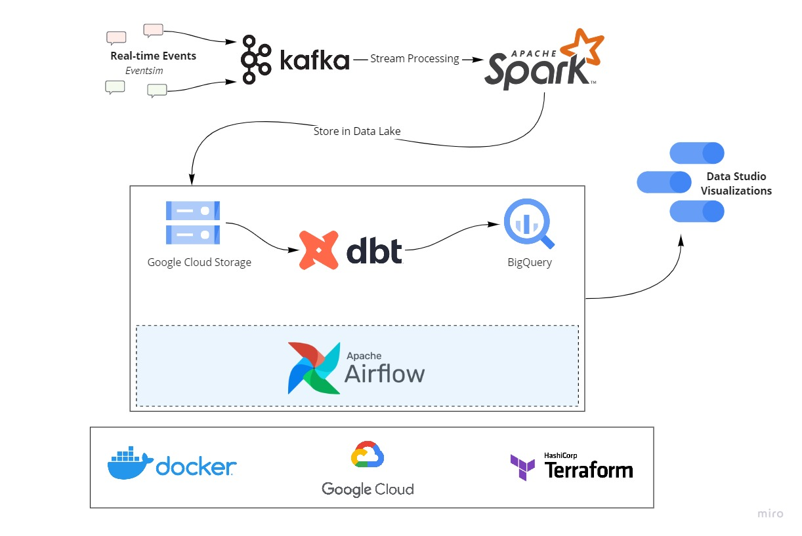

# Streamify — Real-Time Music Data Engineering Pipeline

Streamify is a data engineering project that simulates a music-streaming platform and processes user activity through a real-time data pipeline.

The project combines **Apache Kafka, Spark Structured Streaming, PostgreSQL, dbt, Airflow, Docker, and Terraform**, with an original cloud-oriented architecture using **Google Cloud Storage and BigQuery**.

> **Current local validation:** EventSim → Kafka → Spark Structured Streaming → Parquet → PostgreSQL → dbt has been successfully executed and verified locally.

## Architecture

### Verified Local Pipeline

```text
EventSim
   ↓
Kafka
   ↓
Spark Structured Streaming
   ↓
Partitioned Parquet
   ↓
PostgreSQL
   ↓
dbt
   ↓
Analytical Data Models
```

### Original Cloud Architecture

```text
EventSim
   ↓
Kafka
   ↓
Spark Streaming
   ↓
Google Cloud Storage
   ↓
Airflow
   ↓
BigQuery
   ↓
dbt
   ↓
Analytics Dashboard
```



## Project Objective

Streamify simulates activity from a fictional music-streaming platform.

The pipeline processes:

- Song listening events
- Page-view events
- Authentication events

The goal is to demonstrate an end-to-end data engineering workflow for ingesting, processing, storing, transforming, and analyzing streaming data.

## Technology Stack

| Layer | Technology |
|---|---|
| Event Generation | EventSim |
| Message Streaming | Apache Kafka |
| Stream Processing | Apache Spark Structured Streaming |
| Data Lake Format | Apache Parquet |
| Local Database | PostgreSQL |
| Transformation | dbt |
| Orchestration | Apache Airflow |
| Containerization | Docker / Docker Compose |
| Infrastructure as Code | Terraform |
| Cloud Platform | Google Cloud Platform |
| Programming Language | Python |

## Data Pipeline

### 1. Event Generation

EventSim generates synthetic music-streaming activity.

### 2. Kafka

Events are published to:

```text
listen_events
page_view_events
auth_events
```

### 3. Spark Structured Streaming

Spark consumes Kafka messages, parses the event schemas, converts timestamps, derives time attributes, and writes processed events as partitioned Parquet files.

The local output structure is:

```text
<event>/
└── month=<M>/
    └── day=<D>/
        └── hour=<H>/
```

The local streaming job uses a 120-second processing trigger.

### 4. PostgreSQL

The processed Parquet datasets are loaded into PostgreSQL source tables:

```text
listen_events
page_view_events
```

### 5. dbt

dbt transforms the source data into an analytical dimensional model:

```text
dim_users
dim_songs
dim_artists
dim_location
dim_datetime
fact_streams
wide_streams
```

## Local Validation

The local pipeline has been successfully executed through:

```text
EventSim
   ↓
Kafka
   ↓
Spark Structured Streaming
   ↓
Parquet
   ↓
PostgreSQL
   ↓
dbt
```

During validation, the streaming layer generated:

```text
listen_events     → 248 records
page_view_events  → 301 records
auth_events       → 7 records
```

The `listen_events` and `page_view_events` datasets were loaded into PostgreSQL, followed by a successful dbt run:

```text
PASS = 7
ERROR = 0
```

These are development validation figures, not production-scale metrics.

## Data Model

### Fact Table

`fact_streams`

Contains stream-level analytical records linked to the dimension tables.

### Dimension Tables

| Model | Purpose |
|---|---|
| `dim_users` | User attributes |
| `dim_songs` | Song metadata |
| `dim_artists` | Artist metadata |
| `dim_location` | Geographic information |
| `dim_datetime` | Date and time attributes |

### Analytical View

`wide_streams` combines the fact table with the dimension tables to provide a dashboard-friendly analytical dataset.

## Repository Structure

```text
streamify/
├── airflow/                  # Airflow DAGs
├── dbt/                      # dbt project and models
├── eventsim/                 # Synthetic event generator
├── kafka/                    # Kafka configuration
├── spark_streaming/          # Spark streaming jobs
├── terraform/                # Infrastructure as Code
├── scripts/                  # Helper scripts
├── setup/                    # Setup documentation
├── images/                   # Project images
├── load_listen_to_postgres.py
├── load_page_to_postgres.py
├── requirements.txt
└── README.md
```

Generated runtime data, checkpoints, credentials, virtual environments, logs, and dbt build artifacts are excluded from version control.

## Local Setup

The local development environment uses:

- WSL2 / Linux
- Python
- Docker
- Apache Kafka
- PostgreSQL
- PySpark
- dbt

The repository also contains documentation and infrastructure definitions for the original GCP-based deployment.

## dbt Configuration

Local database credentials are intentionally excluded from Git.

Create:

```text
dbt/profiles.yml
```

using:

```text
dbt/profiles.yml.example
```

and provide your own PostgreSQL connection details.

## Dashboard

The repository contains the original dashboard reference:


A standalone deployable dashboard application is planned for the professional version.

## Engineering Challenges Identified

During local validation, two data-model edge cases were identified:

1. Some `fact_streams` records do not have a matching `dim_songs` record.
2. `dim_artists.artistKey` is not unique for all source records, which can multiply rows when building `wide_streams`.

These are documented as part of the improvement phase.

## Planned Improvements

- Incremental data processing
- Data quality tests
- Improved dimensional modeling
- Automated PostgreSQL loading
- Airflow orchestration
- Production-ready dashboard
- Cloud deployment
- CI/CD
- Monitoring and observability
- Improved documentation

## Data Engineering Concepts Demonstrated

- Event-driven data ingestion
- Kafka streaming
- Spark Structured Streaming
- Partitioned Parquet data lakes
- Batch data loading
- PostgreSQL
- Dimensional modeling
- Fact and dimension tables
- dbt transformations
- Airflow orchestration
- Docker
- Infrastructure as Code with Terraform

## Acknowledgements

This project was developed while learning from the DataTalks.Club Data Engineering curriculum and related open-source resources.

EventSim is used to generate synthetic music-streaming activity.
