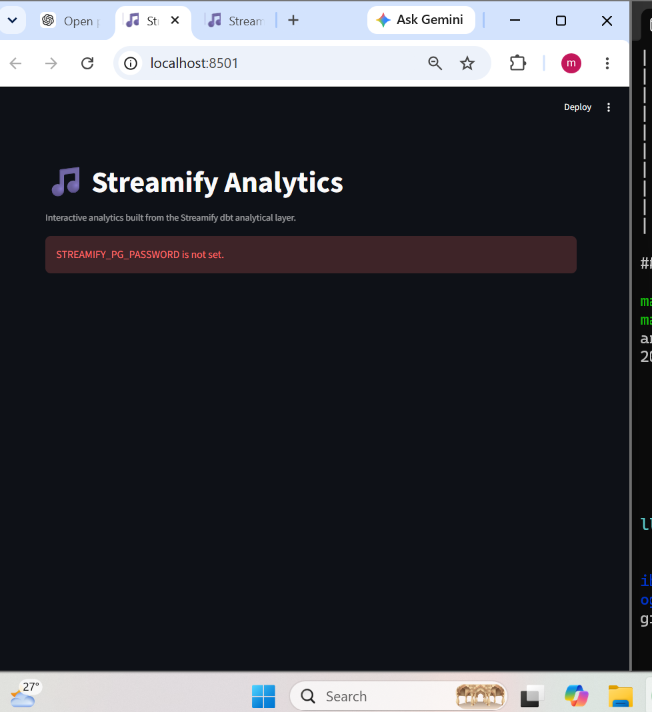

## 🎵 Streamify — Data Engineering & Analytics Pipeline

An end-to-end data engineering project that simulates a music-streaming platform and processes user listening activity through a streaming and analytics pipeline.

## 📌 Project Overview

The project processes simulated music-streaming events through the following workflow:

```text
EventSim
   ↓
Apache Kafka
   ↓
Spark Structured Streaming
   ↓
Partitioned Parquet Data
   ↓
PostgreSQL
   ↓
dbt
   ↓
Analytical Data Models
   ↓
Streamlit Dashboard
## 🎯 Project Objective

This project demonstrates an end-to-end data engineering workflow involving:

Data generation
Event streaming
Stream processing
Data storage
Data transformation
Analytical data modeling
Data visualization
## 📊 Analytics Dashboard

A custom Streamlit dashboard was added to visualize the analytical data generated by the pipeline.

## Dashboard Features
Total Streams
Unique Users
Unique Artists
Unique Songs
Streams Over Time
Streams by User Level
Streams by Gender
Streams by State
Most Active Artists
Most Streamed Songs
Date filtering
User-level filtering
Gender filtering
State filtering
City filtering


## 🛠️ Technology Stack
| Technology     | Purpose                                     |
| -------------- | ------------------------------------------- |
| Python         | Data processing and application logic       |
| Apache Kafka   | Event streaming                             |
| Apache Spark   | Stream processing                           |
| PostgreSQL     | Data storage                                |
| dbt            | Data transformation and analytical modeling |
| Streamlit      | Analytics dashboard                         |
| Docker         | Containerized services                      |
| Apache Airflow | Workflow orchestration                      |
| Terraform      | Infrastructure configuration                |
| GCP            | Cloud infrastructure                        |

## 📁 Project Structure
'''text
streamify-main/
│
├── dashboard/
│   ├── app.py
│   └── requirements.txt
│
├── dbt/
│   └── models/
│
├── eventsim/
│
├── images/
│   └── dashboard.png
│
├── airflow/
├── spark/
├── terraform/
│
├── docker-compose.yml
├── run_dashboard.sh
└── README.md

## 🚀 Running the Dashboard Locally

### 1. Clone the repository

```bash
git clone https://github.com/mansi-797/streamify-data-engineering.git
cd streamify-data-engineering
''''

